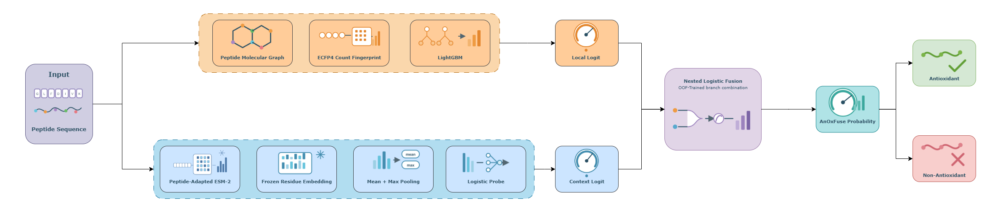
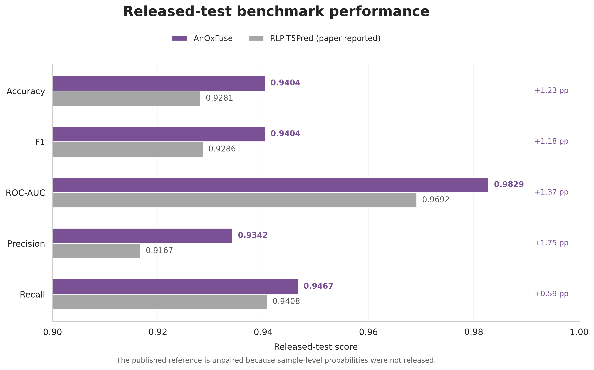
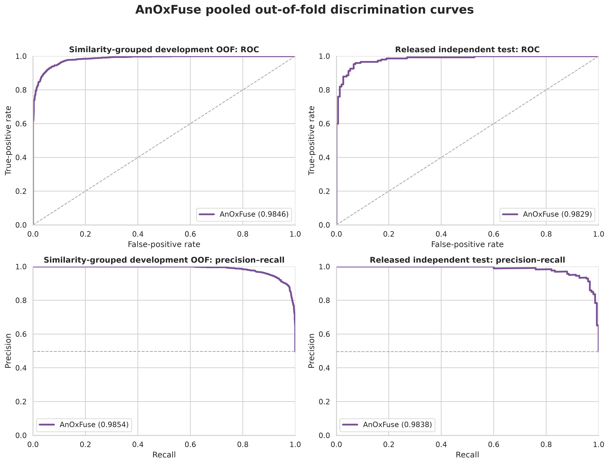

# AnOxFuse

AnOxFuse predicts whether a peptide has antioxidant activity by combining local molecular features with a peptide language model. The complete training and inference workflow is in [`AnOxFuse_model.ipynb`](AnOxFuse_model.ipynb).

## Model

The local branch converts each peptide into a 2,048-dimensional ECFP4 count fingerprint and fits a LightGBM classifier. The context branch extracts frozen residue embeddings from the peptide-adapted `jiahuizhang/esm-150m-peptide-fine-tune` checkpoint, pools them by their mean and maximum, and fits a logistic probe. A nested logistic model combines the two branch logits using out-of-fold predictions from the development data.

## Data

The repository includes three FASTA files derived from the released RLAnOxPeptide data.

| Split | Antioxidant | Non-antioxidant | Total |
|---|---:|---:|---:|
| Development | 1,359 | 1,376 | 2,735 |
| Independent test | 150 | 152 | 302 |

All sequences contain only the 20 standard amino acids, and there are no exact sequence overlaps between the development and test sets.

## Evaluation

Development performance is measured with five-fold stratified group cross-validation. Peptides are grouped at a 60% sequence-similarity cutoff, and the fusion model is trained with nested grouped folds so its meta-learner does not see in-fold branch predictions. ROC-AUC and AUPRC are calculated from probabilities; thresholded metrics use a fixed cutoff of 0.5. The released independent test is kept separate until the final evaluation.

## Results

| Evaluation | ROC-AUC | AUPRC |
|---|---:|---:|
| Grouped development OOF | 0.9846 | 0.9854 |
| Independent test | 0.9829 | 0.9838 |

| Accuracy | F1 | Precision | Recall | MCC |
|---:|---:|---:|---:|---:|
| 0.9404 | 0.9404 | 0.9342 | 0.9467 | 0.8809 |

The independent-test ROC-AUC is numerically above the paper-reported RLP-T5Pred value of 0.9692. The comparison is unpaired because the reference predictions were not released.

