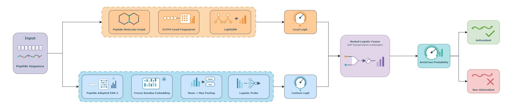
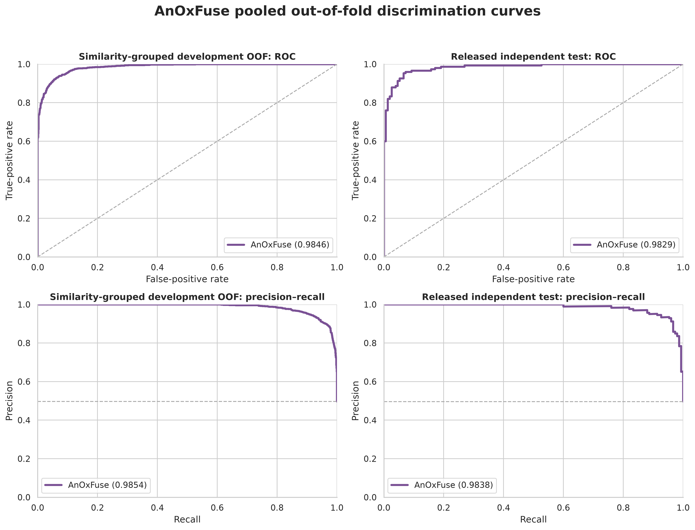

# AnOxFuse

[](https://colab.research.google.com/github/Offpass/AnOxFuse/blob/main/AnOxFuse_model.ipynb)

AnOxFuse predicts antioxidant activity from peptide sequences. It combines molecular fingerprints with a peptide language model to capture both chemical structure and sequence context.



## Model

The molecular branch uses 2,048-dimensional ECFP4 count fingerprints and LightGBM. The sequence branch uses frozen embeddings from [peptide-adapted ESM-2](https://huggingface.co/jiahuizhang/esm-150m-peptide-fine-tune), mean and maximum pooling, and logistic regression. A second logistic regression combines the two branch logits, trained on out-of-fold predictions.

The complete reviewer-facing configuration, experimental settings and supporting paths are collected in [`implementation_details/`](implementation_details/).

## Configuration, implementation and experimental settings

| Section | Component | Configuration or implementation detail |
|---|---|---|
| Data | Task and labels | Binary classification of released antioxidant peptides against an antioxidant-unannotated background; the background is not treated as experimentally confirmed inactive |
| Data | Development set | 1,359 antioxidant and 1,376 background peptides; 2,735 total |
| Data | Independent test | 150 antioxidant and 152 background peptides; 302 total; kept separate from branch fitting, fusion fitting and threshold selection |
| Data | Input validation | Uppercase sequences containing only the 20 standard amino acids; length 2–20 residues; invalid or empty sequences stop the run rather than being imputed |
| Data | Exact overlap | No exact sequence overlap between the released development and independent-test sets |
| Data | Label-orientation check | Seven positive sequences were traced by exact match to experimentally reported peptides from four source studies; this is a spot check rather than complete provenance for the anonymous benchmark |
| Molecular branch | Peptide construction | RDKit `Chem.MolFromFASTA`; standard peptide bonds, free neutral N terminus and neutral C-terminal carboxylic acid; conversion failure stops the run |
| Molecular branch | Representation | Morgan count fingerprint (ECFP4), radius 2, 2,048 hashed `float32` dimensions; bond types and ring membership enabled; Morgan chirality disabled |
| Molecular branch | Scope | Sequence-derived two-dimensional chemical connectivity; no three-dimensional conformation, pH-state ensemble or post-translational modifications |
| Molecular branch | Classifier | LightGBM binary GBDT; 500 estimators, learning rate 0.1, 31 leaves, unlimited depth, `min_child_samples=20`, `min_child_weight=0.001`, full row and column sampling, no L1/L2 regularization, no class weighting, seed 70877 |
| Contextual branch | Encoder | Frozen `jiahuizhang/esm-150m-peptide-fine-tune`, revision `6d8cebf`; parent model `facebook/esm2_t30_150M_UR50D`; evaluation mode |
| Contextual branch | Encoder provenance | The model card reports adaptation on approximately two million PepBenchmark peptide sequences; the adaptation corpus is unavailable, so overlap with this benchmark cannot be excluded |
| Contextual branch | Token handling | Raw uppercase sequence, dynamic padding and no truncation; last hidden state used; padding and special tokens excluded from pooling |
| Contextual branch | Pooling | Residue-wise mean concatenated with element-wise maximum to produce a 1,280-dimensional `float32` vector |
| Contextual branch | Embedding precision | bfloat16 autocast when supported, otherwise float16; pooled arrays stored as `float32` |
| Contextual branch | Classifier | `StandardScaler` followed by L2 logistic regression; `C=1.0`, `liblinear`, maximum 4,000 iterations, tolerance `1e-4`, no class weighting, seed 70877 |
| Fusion | Inputs | Each branch probability is clipped to `[1e-6, 1-1e-6]` and converted to a logit |
| Fusion | Meta-model | Logistic regression with `C=1.0`, `lbfgs` and maximum 2,000 iterations |
| Fusion | Final fitted parameters | Molecular-logit coefficient 0.12124174, contextual-logit coefficient 0.28677884 and intercept 0.33672979 |
| Fusion | Classification threshold | Fixed at 0.5 and not selected using the independent test set |
| Main evaluation | Global seed | 70877 |
| Main evaluation | Outer validation | Five-fold shuffled `StratifiedGroupKFold` on the development set |
| Main evaluation | Headline similarity groups | Deterministic greedy grouping using RapidFuzz `fuzz.ratio`; sequences ordered by decreasing length, sequence text and row index; grouping threshold 60 |
| Main evaluation | Nested fusion | Four grouped inner folds generate out-of-fold branch predictions for fitting the fusion model within each outer fold |
| Main evaluation | Final test fit | Branches refitted on the complete development set; fusion fitted from complete-development out-of-fold branch predictions; independent test evaluated once |
| Main evaluation | Hyperparameter policy | Settings are fixed in the public workflow; the notebook performs no grid or random search, and model choices are not reselected inside every outer fold |
| Main evaluation | Metrics | ROC-AUC, AUPRC, accuracy, balanced accuracy, precision, recall or sensitivity, specificity, F1, MCC, Brier score and log loss |
| Statistics | Confidence intervals | 2,500 class-stratified bootstrap resamples with percentile 95% confidence intervals |
| Statistics | Paired comparisons | Competing prediction vectors evaluated with the same bootstrap indices |
| Statistics | Calibration | Brier score, log loss, 10-bin equal-width and equal-frequency ECE, calibration intercept and calibration slope |
| Statistics | Repeated grouped analysis | Five repeated grouped runs using seeds 42–46; variability reported as the standard deviation across seeds |
| Reviewer controls | Strict sequence independence | Smith-Waterman local alignment with BLOSUM62, gap-open 10 and gap-extension 1; edges require at least 60% identity and at least 80% coverage of both sequences; connected components define cluster-disjoint folds |
| Reviewer controls | Simple baselines | Length-only, AAC plus length, AAC plus DPC plus length, character 1–3-mer and ECFP4 models |
| Reviewer controls | Length and order | Exact length matching, matched-development retraining, overlap weighting, composition-preserving shuffles and residue-order baselines |
| Reviewer controls | Shuffle protocol | Ten unique non-original shuffles targeted per peptide; predictions averaged within each original peptide before paired bootstrapping |
| Reviewer controls | Fusion alternatives | Nested logistic fusion compared with equal probability averaging, equal logit averaging, a learned convex probability mean and feature-level concatenation |
| Reviewer controls | External evaluation | AOPP and AnOxPP tested after exact-overlap removal and after excluding training peptides with at least 60% Smith-Waterman identity and at least 80% reciprocal coverage to an external peptide |
| Reviewer controls | External reference | AAC plus DPC plus length, 421 features, 500-tree random forest, square-root feature sampling, Gini splits, bootstrap sampling, unlimited depth, no class weighting, seed 70877 |
| Visualization | Contextual t-SNE | 1,280-dimensional embeddings reduced to 50 PCA components, then t-SNE with perplexity 30, learning rate `auto`, PCA initialization, 1,500 iterations and seed 70877 |
| Reproducibility | Headline environment | Python 3.12.13, PyTorch 2.12.0+cu130, Transformers 5.14.1, CUDA 13.0 and NVIDIA RTX 5080 |
| Reproducibility | Reviewer GPU run | Python 3.12.14, PyTorch 2.11.0+cu128, CUDA 12.8 and NVIDIA RTX 5090; recorded runtime 1,759 seconds |
| Reproducibility | Locked revision packages | NumPy 2.4.6, pandas 3.0.5, SciPy 1.18.0, scikit-learn 1.9.0, LightGBM 4.7.0, RDKit 2026.3.4, Biopython 1.87, parasail 1.3.4, RapidFuzz 3.14.5 and Transformers 5.14.1 |
| Reproducibility | Historical limitation | Exact historical scikit-learn, LightGBM and RDKit versions from the original headline run were not recorded; the locked revision environment documents the reproducibility rerun |

## Data and evaluation

The [FASTA files](data/) come from the released RLAnOxPeptide dataset.

| Split | Antioxidant | Unannotated background | Total |
|---|---:|---:|---:|
| Development | 1,359 | 1,376 | 2,735 |
| Independent test | 150 | 152 | 302 |

The background peptides are not experimentally confirmed inactive controls. There is no exact sequence overlap between the development and test sets.

Development evaluation uses five-fold sequence-similarity-grouped cross-validation with nested fusion. The independent test is evaluated separately, with a classification threshold of 0.5. Additional sequence-similarity, length, shuffle and external-dataset analyses are in [reproducibility/](reproducibility/).

## Usage

Run [AnOxFuse_model.ipynb](AnOxFuse_model.ipynb) to train and evaluate the model. An NVIDIA GPU is recommended for extracting ESM-2 embeddings.

To predict from a FASTA file using the included trained classifiers, install a compatible PyTorch build, then:

```bash
python -m pip install -r requirements-gpu.txt
python predict.py --input examples/example_peptides.fasta --output predictions.csv --device auto
```

Sequences must use the 20 standard amino acids. The output contains both branch probabilities, the combined probability and the predicted class. Small batches can also run on CPU.

The [saved classifiers](models/) were refitted from the original feature matrices and reproduce the reported test metrics and class predictions. To check the release:

```bash
python -m pip install -r requirements.txt
python scripts/validate_release.py
```

## Results

| Evaluation | ROC-AUC | AUPRC | MCC |
|---|---:|---:|---:|
| Grouped development cross-validation | 0.9846 | 0.9854 | 0.8662 |
| Independent test | 0.9829 | 0.9838 | 0.8809 |
| Whole-pool cluster-disjoint sensitivity analysis | 0.9815 | 0.9820 | 0.8485 |

Independent-test accuracy and F1 are both **0.9404**, with precision **0.9342** and recall **0.9467**. The cluster-disjoint result is a separate sensitivity analysis, not a replacement test set.


