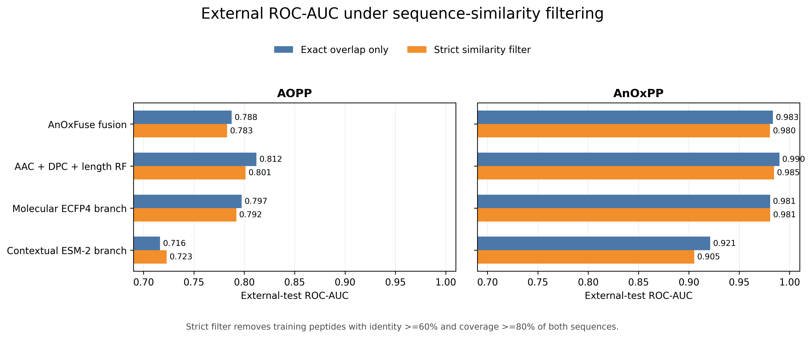
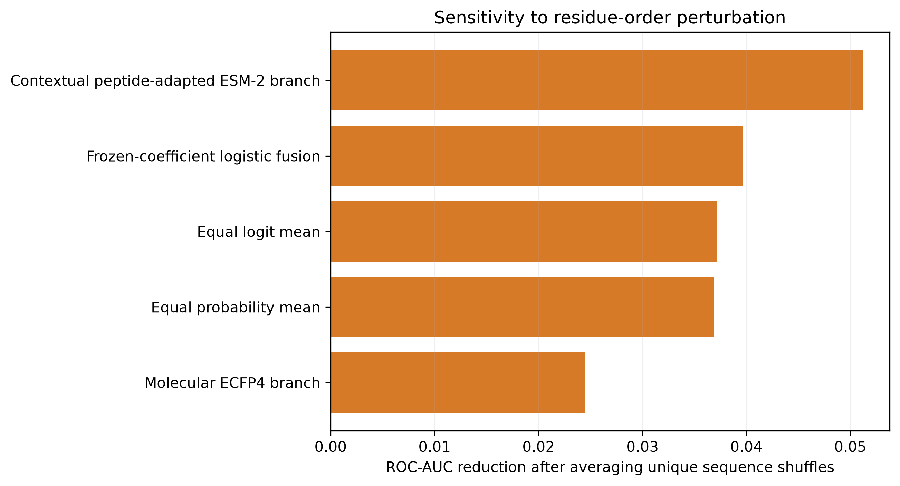

# AnOxFuse

[](https://colab.research.google.com/github/Offpass/AnOxFuse/blob/main/AnOxFuse_model.ipynb)

AnOxFuse is a binary peptide classifier that combines a sequence-derived chemical-connectivity branch with a frozen peptide language model. It estimates membership in the released antioxidant-peptide class. Because the background class is antioxidant-unannotated rather than experimentally confirmed inactive, its output should not be treated as direct experimental proof of antioxidant activity.


## Repository contents

| Path | Contents |
|---|---|
| [`AnOxFuse_model.ipynb`](AnOxFuse_model.ipynb) | Main training and evaluation workflow |
| [`data/`](data/) | Released development and independent-test FASTA files |
| [`predict.py`](predict.py) | FASTA-to-prediction command-line interface |
| [`models/`](models/) | Validated release-refit classifiers and artifact manifest |
| [`reproducibility/`](reproducibility/) | Reviewer experiments, locked inputs, fold assignments, predictions, figures and result tables |
| [`scripts/validate_release.py`](scripts/validate_release.py) | Integrity and released-test reproduction check |
| [`scripts/rebuild_release_artifacts.py`](scripts/rebuild_release_artifacts.py) | Rebuilds the lightweight release artifacts from frozen features |

## Data and label handling

The repository uses the RLAnOxPeptide-derived release files shown below. Class 1 is the released antioxidant class. Class 0 is an antioxidant-unannotated background class, not a set of experimentally verified inactive peptides.

| File | Role | Antioxidant | Background | Total |
|---|---|---:|---:|---:|
| `remaining_positive.fasta` + `remaining_negative.fasta` | Development | 1,359 | 1,376 | 2,735 |
| `independent_test_cleaned.fasta` | Released independent test; labels are encoded in the headers | 150 | 152 | 302 |

Released sequences are 2-20 residues long and must contain only `ACDEFGHIKLMNPQRSTVWY`. Empty sequences and nonstandard residues stop the run; no unknown-residue substitution is performed. There is no exact sequence overlap between the development and test files. Seven positive sequences were traced by exact match to experimentally reported peptides from four source studies; this is a label-orientation spot check, not complete provenance for the anonymous benchmark. The supporting table is [`positive_label_source_spotcheck.csv`](reproducibility/final_results/tables/positive_label_source_spotcheck.csv).

## Model implementation

### Molecular branch

This branch is an atom-level local chemical encoding derived deterministically from the peptide sequence. It is not a three-dimensional structure, solution conformation, pH-state ensemble or representation of post-translational modifications.

| Component | Setting |
|---|---|
| Peptide construction | RDKit `Chem.MolFromFASTA`; standard peptide bonds, free neutral N terminus and neutral C-terminal carboxylic acid |
| Failure handling | Abort on conversion failure; no imputation or silent row removal |
| Fingerprint | Morgan count fingerprint (ECFP4), radius 2, 2,048 hashed `float32` dimensions |
| Chemical options | Bond types and ring membership included; residue stereochemistry retained in the molecule; Morgan chirality disabled |
| Classifier | LightGBM GBDT, binary objective |
| LightGBM settings | 500 estimators; learning rate 0.1; 31 leaves; unlimited depth; `min_child_samples=20`; `min_child_weight=0.001`; full row and column sampling; L1/L2 regularization 0; no class weighting; all CPU threads; seed 70877 |

### Contextual branch

| Component | Setting |
|---|---|
| Encoder | Frozen [`jiahuizhang/esm-150m-peptide-fine-tune`](https://huggingface.co/jiahuizhang/esm-150m-peptide-fine-tune), revision `6d8cebf`, evaluation mode |
| Parent model | `facebook/esm2_t30_150M_UR50D` |
| Input | Raw uppercase sequence; dynamic padding; no truncation |
| Hidden representation | Last hidden state; padding and all special tokens excluded |
| Pooling | Residue-wise mean concatenated with element-wise maximum |
| Output | 1,280-dimensional `float32` vector |
| GPU precision | bfloat16 when supported, otherwise float16 autocast; pooled arrays are stored as float32 |
| Classifier | `StandardScaler` followed by L2 logistic regression |
| Logistic settings | `C=1.0`; `liblinear`; maximum 4,000 iterations; tolerance `1e-4`; no class weighting; seed 70877 |

The checkpoint model card describes fill-mask adaptation on approximately two million PepBenchmark peptide sequences. That adaptation corpus is not public, so exact or similarity-based overlap with this benchmark cannot be excluded. Checkpoint provenance and the archived comparators are recorded in [`checkpoint_provenance.csv`](reproducibility/final_results/tables/checkpoint_provenance.csv). The final model uses peptide-adapted ESM-2 150M. The standard sensitivity comparator was `facebook/esm2_t30_150M_UR50D` at revision `a695f60`. An archived large-encoder run used `Synthyra/ESMplusplus_large`, not ESM-C; its historical revision was not recorded.

### Fusion

Each branch probability is clipped to `[1e-6, 1 - 1e-6]` and converted to a logit. A logistic meta-model then combines the two logits with `C=1.0`, the `lbfgs` solver and a maximum of 2,000 iterations. The published classification threshold is fixed at 0.5 and is not selected on the test set.

For development evaluation, the fusion model is trained only from out-of-fold branch predictions. Within every outer fold, four grouped inner folds generate branch predictions for meta-model fitting. The final test model fits each branch on the complete development set and fits the meta-model on complete development out-of-fold branch predictions. The frozen final fusion coefficients are 0.12124174 for the molecular logit and 0.28677884 for the contextual logit, with intercept 0.33672979.

All listed hyperparameters are fixed settings in the public final workflow. No grid or random search is run by the notebook, and the representation and estimator choices were not reselected inside every outer fold.

## Main experimental protocol

The headline development estimate uses five-fold shuffled `StratifiedGroupKFold` with global seed 70877. Development groups are built with a deterministic greedy procedure:

1. Pairwise similarity is computed with RapidFuzz `fuzz.ratio`.
2. Sequences are ordered by decreasing length, then sequence text and original row index.
3. The next unassigned sequence becomes a representative and absorbs all unassigned sequences scoring at least 60.

This is an approximate RapidFuzz grouping rule, not a Smith-Waterman identity calculation. It keeps all 2,735 development rows and prevents a constructed group from crossing validation folds. The 302-row released test remains untouched during branch fitting, fusion fitting and threshold selection.

The main metrics are ROC-AUC and AUPRC from probabilities, plus accuracy, F1, precision, recall, specificity and MCC at threshold 0.5. Brier score and log loss assess probabilistic error. Development values marked OOF are pooled out-of-fold predictions, not training-set predictions.

## Statistical analysis

- Confidence intervals use 2,500 class-stratified peptide bootstrap resamples and the 2.5th and 97.5th percentiles.
- Paired model comparisons use the same sampled indices for both prediction vectors.
- Calibration reports Brier score, log loss, 10-bin equal-width and equal-frequency ECE, and logistic calibration intercept and slope.
- Repeated grouped sensitivity experiments use seeds 42-46; reported variability is the standard deviation across those five seeds.
- The contextual t-SNE figure reduces the 1,280-dimensional vector to 50 PCA components, then uses perplexity 30, learning rate `auto`, PCA initialization, 1,500 iterations and seed 70877. Class and peptide-length views use the same coordinates.

## Reviewer-directed controls

These experiments are sensitivity analyses; they do not replace the frozen released-test benchmark.

### Strict sequence independence

The whole-pool analysis uses Smith-Waterman local alignment with BLOSUM62, gap-open 10 and gap-extension 1. Identity is exact residue matches divided by all alignment columns. Coverage is aligned non-gap residues divided by each complete sequence length. An edge requires at least 60% identity and at least 80% coverage of both sequences; connected components define groups for cluster-disjoint folds. This is deliberately stricter than the headline RapidFuzz procedure. Full assignments and fold audits are in [`strict_cluster_disjoint_assignments.csv`](reproducibility/reviewer_revision/revision_outputs/cpu/tables/strict_cluster_disjoint_assignments.csv) and [`strict_cluster_disjoint_fold_audit.csv`](reproducibility/reviewer_revision/revision_outputs/cpu/tables/strict_cluster_disjoint_fold_audit.csv).

### Confounding and representation controls

The revision includes length-only, AAC+length, AAC+DPC+length, character 1-3-mer and ECFP4 controls. It also evaluates exact length matching, matched-development retraining, overlap weighting, composition-preserving shuffles and residue-order baselines. Ten unique non-original shuffles were targeted per peptide; 2,719 variants were generated for 301 of 302 test peptides, then predictions were averaged within the original peptide before paired bootstrapping. This perturbation tests sensitivity to residue order under an artificial distribution shift; it does not establish a biological mechanism.

### Fusion alternatives

Nested logistic fusion is compared with equal probability averaging, equal logit averaging, a learned convex probability mean and feature-level concatenation. Its released-test AUC gain over the contextual branch is 0.00364 with a paired 95% interval of -0.00088 to 0.00820, so the incremental molecular contribution is promising but not statistically resolved by this test set. The repository does not claim that nested fusion is uniquely superior.

### External transfer

AOPP and AnOxPP are evaluated under both exact-overlap removal and a stricter training exclusion that removes any training peptide with at least 60% Smith-Waterman identity and at least 80% reciprocal coverage to an external test peptide. Under the strict protocol, AOPP retains 1,345 of 2,077 training peptides and AnOxPP retains 1,487 of 2,077. Every external model is refitted on the retained training pool and assessed on the fixed external test set.

The external AAC+DPC+length reference contains 421 features and uses a 500-tree random forest with square-root feature sampling, Gini splits, bootstrap sampling, unlimited depth, minimum split 2, minimum leaf 1, no class weighting and seed 70877. This simple reference is numerically better than fusion on both external tests, so the external results are interpreted as dataset-dependent transfer rather than broad superiority. Protocol counts and predictions are available in [`external_dataset_audit.csv`](reproducibility/final_results/tables/external_dataset_audit.csv) and [`external_protocol_metrics.csv`](reproducibility/final_results/tables/external_protocol_metrics.csv).

## Software and hardware

| Run | Recorded environment |
|---|---|
| Published headline | Python 3.12.13; PyTorch 2.12.0+cu130; Transformers 5.14.1; CUDA 13.0; NVIDIA RTX 5080 |
| Reviewer GPU completion | Python 3.12.14; PyTorch 2.11.0+cu128; CUDA 12.8; NVIDIA RTX 5090; runtime 1,759 s |
| Locked revision packages | NumPy 2.4.6; pandas 3.0.5; SciPy 1.18.0; scikit-learn 1.9.0; LightGBM 4.7.0; RDKit 2026.3.4; Biopython 1.87; parasail 1.3.4; matplotlib 3.11.1; seaborn 0.13.2; joblib 1.5.3; RapidFuzz 3.14.5; Transformers 5.14.1 |

The exact historical scikit-learn, LightGBM and RDKit versions used for the original headline run were not recorded. The locked revision environment documents the reproducibility rerun; it should not be mistaken for the missing historical environment. Complete manifests are in [`environment_manifest.json`](reproducibility/reviewer_revision/baseline/environment_manifest.json), [`method_manifest.json`](reproducibility/reviewer_revision/revision_outputs/cpu/method_manifest.json) and [`gpu_environment_and_method.json`](reproducibility/final_results/tables/gpu_environment_and_method.json).

## Running AnOxFuse

The main notebook obtains the tracked FASTA files locally or from this repository. PyTorch must already match the CUDA driver; the notebook deliberately does not replace it. A full run needs an NVIDIA GPU for initial ESM-2 feature extraction and checks for at least 8 GiB of free disk. The default embedding batch size is 256 and is halved automatically after a CUDA out-of-memory error. Cached embeddings allow the downstream analyses to run without repeating the encoder pass.

### Prediction with the released artifacts

```bash
python -m pip install -r requirements-gpu.txt
python predict.py --input examples/example_peptides.fasta --output predictions.csv --device auto
```

Input is standard FASTA with arbitrary headers and the 20-residue alphabet stated above. The output contains molecular, contextual and fused probabilities plus the thresholded class. CUDA is recommended; CPU inference is supported for small inputs but is slower.

The three Joblib classifiers in [`models/`](models/) are documented release refits from the frozen published feature matrices, not byte-identical copies of the original in-memory estimators. Their largest difference from the frozen historical test probabilities is `3.824e-05`; all released-test class decisions and reported metrics are identical.

```bash
python -m pip install -r requirements.txt
python scripts/validate_release.py
```

The reviewer workflows and their exact dependencies are in [`reproducibility/reviewer_revision`](reproducibility/reviewer_revision). The CPU notebook uses frozen GPU-derived embeddings; the GPU notebook regenerates encoder-dependent analyses. Detailed navigation is in [`reproducibility/README.md`](reproducibility/README.md).

## Results

### Main evaluation

| Evaluation | ROC-AUC | AUPRC | Accuracy | F1 | MCC | Brier |
|---|---:|---:|---:|---:|---:|---:|
| Similarity-grouped development OOF | 0.9846 | 0.9854 | 0.9331 | 0.9325 | 0.8662 | 0.0484 |
| Released independent test | 0.9829 | 0.9838 | 0.9404 | 0.9404 | 0.8809 | 0.0491 |

The released test has precision 0.9342, sensitivity/recall 0.9467 and specificity 0.9342, corresponding to TN=142, FP=10, FN=8 and TP=142.

| Released-test metric | Estimate | Bootstrap 95% interval |
|---|---:|---:|
| ROC-AUC | 0.9829 | 0.9703-0.9930 |
| AUPRC | 0.9838 | 0.9719-0.9933 |
| Accuracy | 0.9404 | 0.9139-0.9669 |
| F1 | 0.9404 | 0.9133-0.9664 |
| MCC | 0.8809 | 0.8279-0.9338 |

Released-test calibration gives Brier score 0.0491, equal-frequency 10-bin ECE 0.0206, calibration intercept -0.3040 and slope 0.9218. These values describe this evaluation set and are not a general calibration guarantee.

### Reviewer controls

| Analysis | Result | Interpretation |
|---|---|---|
| Whole-pool strict cluster-disjoint OOF, 3,037 peptides | ROC-AUC 0.9815 (0.9778-0.9848); AUPRC 0.9820 (0.9785-0.9853); MCC 0.8485 (0.8301-0.8670) | Performance remains high when strict components cannot cross folds |
| Exact length-matched released-test subsets, 2,500 draws of 102 peptides | Mean ROC-AUC 0.9309; selection interval 0.9085-0.9535 | Length explains part, but not all, of the discrimination |
| AAC+DPC+length random forest | Released-test ROC-AUC 0.9676 | Simple composition and length features are strong controls |
| Character 1-3-mer logistic regression | Released-test ROC-AUC 0.9643 | Adjacent sequence patterns are also highly predictive |
| Composition-preserving shuffles | Fusion ROC-AUC 0.9827 to 0.9430; paired drop 0.0397 (0.0224-0.0600) | Predictions use order information, but the perturbation is not a mechanistic experiment |
| Strict AOPP transfer | Fusion ROC-AUC 0.7830 vs RF 0.8013 | The simple reference is stronger on AOPP |
| Strict AnOxPP transfer | Fusion ROC-AUC 0.9804 vs RF 0.9846 | Both transfer strongly; the simple reference remains numerically higher |

The published comparison with RLP-T5Pred remains unpaired because its sample-level predictions were unavailable; no statistical superiority claim is made from the numerical ROC-AUC difference. Full result tables and prediction-level outputs are retained under [`reproducibility/final_results`](reproducibility/final_results).





